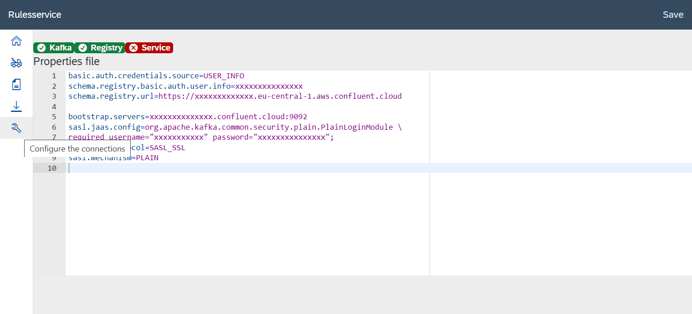
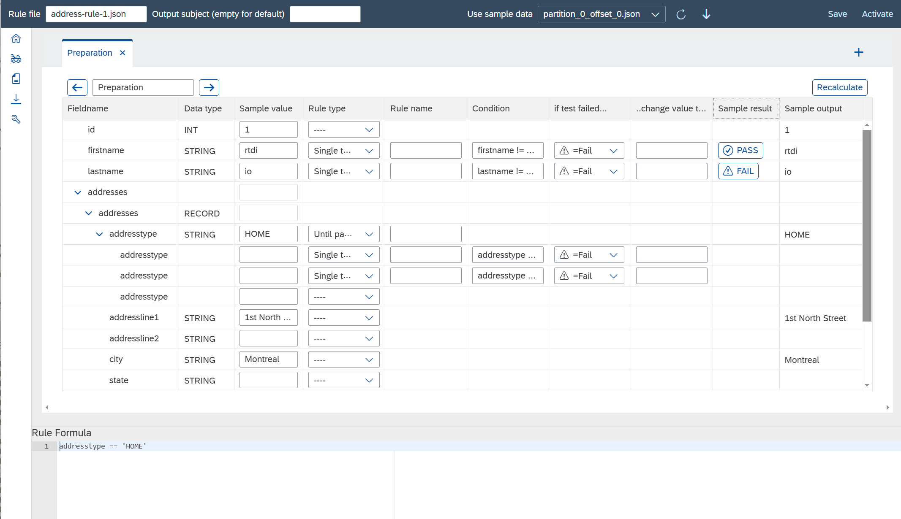
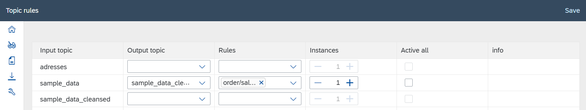
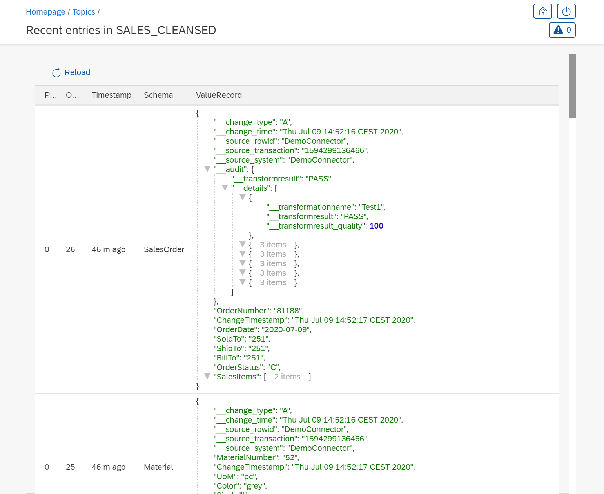
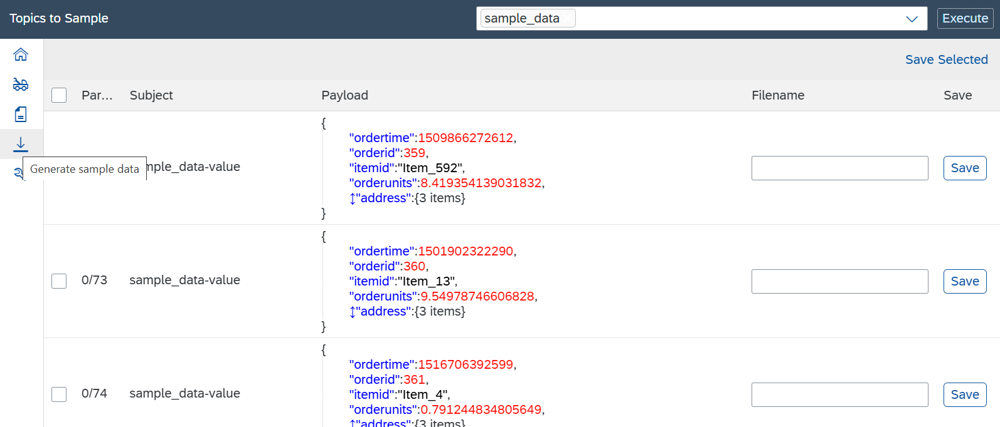

# RTDI Rules Service

_Validate incoming messages and augment them with rule testing results_

Source code available here: [github](https://github.com/rtdi/RTDIRulesService)

Docker image here: [dockerhub](https://hub.docker.com/r/rtdi/rulesservice)

## Design Thinking goal

* As a business user I would like to validate the incoming data and cleanse it in realtime
* Consumers have the choice to read the raw or the cleansed data
* Operational dashboards using the rule results provide information about the data quality
* Different types of rules should be supported, validation rules, cleansing rules, data augmentation, standardization rules,...

## Requirements

* Payload (value) in Avro Format
* Apache Kafka connection with the permissions to run as a KStream
* Schema Registry connection to read (and write) schema definitions


## Installation and testing

On any computer install the Docker Daemon - if not already done - and download the docker image with

    docker pull rtdi/rulesservice

Then start the image via docker run. For a quick test this command is sufficient...

    docker run -d -p 80:8080 --rm --name rulesservice  rtdi/rulesservice

to expose a webserver at port 80 on the host running the container. Make sure to open the web page via the http prefix, as https needs more configuration.
For example [http://localhost:80/](http://localhost:80/) might do the trick if the container is hosted on the same computer.

The default login for this startup method is: **rtdi / rtdi!io**

The better start command is to mount two host directories into the container, the rtdiconfig directory where all settings made when configuring the connector will be stored permanently and the security directory for web server specific settings like user database and SSL certificates.

    docker run -d -p 80:8080 -p 443:8443 --rm \
       -v /home/dir/rulesservice:/apps/rulesservice \
       -v /home/dir/security:/usr/local/tomcat/conf/security \
        --name rulesservice  rtdi/rulesservice


For proper start commands, especially https and security related, see the [ConnectorRootApp](https://github.com/rtdi/ConnectorRootApp) project, this application is based on.


### Step 1: Connect to Kafka

The first step is to connect the application to a Kafka server and the schema registry. In the settings screen the normal Kafka properties file data can be pasted and saved. By default the file location is `/apps/rulesservice/settings/kafka.properties` from the container's point of view.




```
basic.auth.credentials.source=USER_INFO
schema.registry.basic.auth.user.info=XXXXXXXXXXXXXXXX:XXXXXXXXXXXXXXXXXXXXXXXXXXXXXXXXXXXXXXXXXXXXXXXXXXXXXXXXXXXXXXXX
schema.registry.url=https://XXXXXXXXXX.eu-central-1.aws.confluent.cloud

bootstrap.servers=XXXXXXXXX.eu-central-1.aws.confluent.cloud:9092
sasl.jaas.config=org.apache.kafka.common.security.plain.PlainLoginModule \
required username="XXXXXXXXXXXXXXXX" password="XXXXXXXXXXXXXXXXXXXXXXXXXXXXXXXXXXXXXXXXXXXXXXXXXXXXXXXXXXXXXXXX";
security.protocol=SASL_SSL
sasl.mechanism=PLAIN
```


### Step 2: Define Rules

A rule file applies logic to messages of a given schema/subject. It consumes the input message, applies the rules and creates an output message with a derived schema - a schema that contains the rule results as additional field. What the input and output topic is, will be configured in the next step.

Rule files are saved by default in the directory `/apps/rulesservice/definitions/<subject name>/inactive>/....` and the file name itself can contain sub-directories.

To simplify entering rules, sample values can be entered and the result be recalculated. A quick way to provide sample values is by reading topics and creating sample files with the content - see below. These files, with messages of the same subject name, can be selected and hence used as input.

Once a rule file is complete, it must be copied from the `inactive` to the `active` directory. The button `Activate` does that. The reason for this two staged approach is to allow users saving intermediate definitions without impacting the currently running service.




### Step 3: Topics

An input topic can contain messages of different subjects, hence the dialog asks what input topic should cater which rule files (remember, a rule file work on a specific subject) and what the output topic should be.
Scaling is achieved by increasing the number of KStream instances used for this topic or by spinning up more containers with the same settings.

The screen also allows to copy the rule files being used into the active folder to simplify activating each from the rule file dialog.



### Result

If the input schema has an `_audit` field, it is assumed the schema contains the structure for the rule results already. This would be a preferred case, because input schema = output schema.
In all other cases the input schema's latest version is read from the schema registry and the additional `_audit` structure is being created. This will be the output schema.

The reason for using the latest is because of schema evolution scenarios. It might happen that schema id 2 has an additional field `NAME` compared to schema id 1. So the subject evolved from schema 1 to 2. The KStream does receive a message with schema 2 first, adds the `_audit` field and it is saved in the schema registry. The next message has an input schema 1 and if that would get registered as output schema next, it would fail due to the missing `NAME` field. Hence both must be outputted with the latest schema version always. This also explains why adding the `_audit` on the original input schema already is preferred.
The overall rule result is stored (did it pass all tests?), a list of all rules executed and their individual results.
Querying this data allows detailed reporting which records were processed by what rule and the results.

The exact Avro schema field definition can be found [here](docs/audit-schema.md)




### Sample files

To create sample files, one or multiple topics are selected in the screen and executed. All topics and all their partitions are read to find the most recent 100 messages.
The found messages are streamed in chunks into the screen and can be saved, either individually or by selecting some/all in the table and clicking the `Save selected` button.

The files are stored in the directory `/apps/rulesservice/definitions/<subjectname>/sampledata/`.
If no file name is specified, the name will be `partition_<partition>_offset_<offset>.json`.



## Rules

### Rule Formula

The Single Test rule type applied to a field is used to specify conditions and optionally to modify a value.
The Condition is a formula like `firstname != null` and specifies what the expected rule is - here it is expected that the firstname field has a value. This formula must return true or false.


 and if false, the `if test failed...` setting tells the severity. In most cases a false means the test `=Fail`, but it can be set to `=Warn` or even `=Pass`. 

Formulas can get more complicated obviously, e.g. `lastname != null && lastname.length() > 10`.

Formulas can also access other fields as well, e.g. for the field `lastname` the condition is `lastname != null || firstname != null` meaning, either lastname or firstname must be set.

To access fields of a deeper level, e.g. when lastname is set, the first record in the addresses array must have addresstype HOME, many cases must be considered. What if the addresses array is empty? What if the addresses array is an empty array? What if the addresstype field is null for some records? This would lead to a very long condition but there are shortcuts: `lastname != null && 'HOME' == addresses?[0]?addresstype`. The `?` tells that it is okay if the field is null and it should return null then.

Formulas at a deeper level, e.g. a formula for `addresstype`, can access fields from the higher level via `parent`. Example: `('HOME' == addresstype && parent.parent.lastname != null) || 'HOME' != addresstype` tells that for addresstype HOME the lastname must be set as well, for all other addresstype values there is no such requirement.

Note: In this example the customer record has an addresses array of address record. When within an address record, the parent is the array and its parent is the customer record with the lastname field.

These are just very basic examples, more below.

If a condition returns false, maybe the correct value can be derived and then the rule as such has not been violated. The optional formula entered in `..change value to...` is executed only if the condition returns false and it overwrites the field value. Example: The rule for the field `addresstype` is `addresstype.upper() != addresstype` and the change-value formula is `addresstype.upper()`. This does change all values to upper case. In such a case the rule is considered to have been passed instead of failed, and that is accomplished via the `if test failed...` setting `=Pass`.
Each test and its rule result is available in the audit structure and hence we can see that this test was executed and passed.


### Rule Sets

In above examples there was the test `('HOME' == addresstype && parent.parent.lastname != null) || 'HOME' != addresstype`. A more realistic formula would say: if HOME then the lastname must be set, if COMPANY the companyname field must be set and other allowed values are SHIPPING and BILLING. This would get quite a long formula.

To simplify that, the Test-Set rule allows to specify multiple individual rules

 - Test for all conditions (`Test all`): Every single rule is applied, thus acting as a AND combination of rules. This is convenient for cases where a field needs to be checked for different conditions, e.g. the OrderDate has to be within three months or raise a warning and the OrderDate cannot be later than the expected delivery date. The rule set will return the lowest individual rule result. If all passed the result is pass. If at least one said warning, the result is a warning. And if one is failed, the result is failed.
 - Test until one failed (`Until failed`): Each rule will be tested and stopped once the first rule violation is found. It is a AND combination of the rules as well but while in above case all rules are tested, here all other rules are not added to the test result. The rule set will return failed when at least one is failed and pass only if all rules passed.
 - Test until one passes (`Until passes`): This is an OR condition. If condition1 is not met, maybe condition2 is. As soon as the first positive test is found, no further processing is needed, a valid value has been found. The rule set will return failed only if all tests failed. One positive test makes the entire rule set positive and the remaining tests are not executed.
 
For the addresstype example, the `Until-passes` test set is best suited with the individual rules

 - `'HOME' == addresstype && parent.parent.lastname != null`
 - `'COMPANY' == addresstype && parent.parent.companyname != null`
 - `'SHIPPING' == addresstype`
 - `'BILLING' == addresstype`
 
If the addresstype is `SHIPPING`, then the first test returns false, hence the second is executed also returning false and the third condition returns true --> no more tests being made and the test-set is Pass.

If the addresstype is `ABCD`, none of the conditions will return true --> the test-set is Fail.

This simplifies creating difficult rules, especially in combination with the `if test failed...` setting, e.g. a `SoldTo == null` shall be treated as failed, `SoldTo.length() < 5` as well but `SoldTo.length() < 10` shall be a warning only.


### Generic rules

Each record also has a `(more)` node to enter rules that do not belong to a single field. Such generic rules cannot have a change-value formula as they are not bound to a field.


### Rule Steps

Another typical scenario is to standardize the values first, e.g. gender should be `M`, `F`, `X`, `?` only and then create rules based on the standardized values. In other words, rules build on each other. To enable that, the rule file consists of multiple tabs - the rule steps - and each tab is executed one after the other.


### Rule syntax

For more examples [see](docs/rule-syntax.md)


### FAQs

 * Can a new output column be created via a formula? No, the output schema is always derived from the input schema, for two reasons. First, if adding fields would be possible, it might collide when the input subject is evolved to a new version. The other reason is performance. It would require to create a new output message from scratch, copying the majority of the data even if nothing has changed. That would be too expensive. So the only option is to add the column to the input schema first.


## Licensing

This application is provided as dual license. For all users with less than 100'000 messages processed per month, the application can be used free of charge and the code falls under a Gnu Public License. Users with more than 100'000 messages per month are asked to get a  to support further development of this solution. The commercial license is on a monthly pay-per-use basis.


## Data protection and privacy

Every ten minutes the application does send the message statistics via a http call to a central server where the data is stored for information along with the public IP address (usually the IP address of the router). It is just a count which service was invoked how often, no information about endpoints, users, data or URL parameters. This information is collected to get an idea about the adoption.
To disable that, set the environment variable STATISTICS=FALSE.